 

## Hi, I'm Fatih

I'm an e-commerce technology lead at **Massimo Medya**. I run a small software team and look after the technical side of 22 live online stores. Most of my work is on Shopify: custom themes, apps, Shopify Functions, and the integrations that keep stores, marketplaces, shipping and inventory in sync.

I started out building full-stack apps with C#/.NET and Angular, and I still build and sell plugins for Rust game servers. I'm also studying Management Information Systems at Anadolu University.

| 22 | 40+ | 60+ | 1,000+ |
| :---: | :---: | :---: | :---: |
| live stores | custom themes | brands | plugin sales |

## What I work on

- **Shopify engineering:** Liquid and Online Store 2.0 sections, Shopify CLI, Shopify Functions, Checkout Extensibility, theme app extensions, metafields and metaobjects, AJAX carts, B2B, Core Web Vitals
- **Apps and integrations:** Admin and Storefront APIs, GraphQL, REST, webhooks; ERP, CRM, inventory, marketplace, payment and shipping integrations
- **Conversion work:** landing pages, bundles, upsell and cross-sell flows, cart experiences, trust elements
- **Platforms:** Shopify, WooCommerce, ikas, IdeaSoft, Ticimax
- **Team and delivery:** hiring, task planning, code review, release approval, client discovery, AI-assisted workflows

  
  
  
  
  
  
  
  
  
  
  
  
  
  

## Selected work

Most of my day-to-day work lives in private client repositories, so here is a short summary instead.

**Multi-store Shopify ↔ Trendyol integration** · _production app_ 
Node.js · TypeScript · Next.js · Firebase Cloud Functions · Firestore · Shopify Functions 
Maps Trendyol products to Shopify catalogs and imports qualifying Trendyol reviews into the matching Shopify products. Syncs through product webhooks, scheduled polling and manual controls, shows international shipping costs before purchase, and ships Shopify Function extensions to several live stores.

**40+ custom Shopify themes** 
Liquid · Online Store 2.0 · JavaScript 
Brand-specific themes built around each store's identity, content model and sales goals. Case studies are on [fatihselvi.com](https://fatihselvi.com).

**Shopify store health dashboard** · _in progress_ 
TypeScript 
A local, multi-store panel that checks store health and suggests conversion fixes, so problems surface before customers notice them.

**Rust server plugins** 
C# · Oxide/uMod 
Five commercial plugins for Rust server owners on [Codefling](https://codefling.com/fateeh): 1,000+ sales and 50,000+ views in the first year, still live and selling. Starter code is in [Rust-Plugin-Templates](https://github.com/Fateehs/Rust-Plugin-Templates).

**cRPG backend** · _2024_ 
C# · MySQL 
Backend work on the [cRPG](https://github.com/crpg2/crpg) multiplayer mod for Mount & Blade II: Bannerlord. Optimized data processing and CRUD paths and improved server performance by about 35%.

<b>Earlier open-source projects</b> (.NET and Angular)

 

| Project | Stack | Code |
| --- | --- | --- |
| Arıcım: hive management app for beekeepers | .NET 8 Web API, Angular | [API](https://github.com/Fateehs/AricimAPI) · [Web](https://github.com/Fateehs/Aricim) |
| RentACar: car rental web app | .NET, Angular | [Backend](https://github.com/Fateehs/RentACar-Backend) · [Frontend](https://github.com/Fateehs/RentACar-Frontend) |
| E-Commerce web app | .NET, Angular | [Backend](https://github.com/Fateehs/E-Commerce-Backend) · [Frontend](https://github.com/Fateehs/E-Commerce-Frontend) |
| Northwind product app | .NET, Angular | [Backend](https://github.com/Fateehs/Northwind-Backend) · [Frontend](https://github.com/Fateehs/Northwind-Frontend) |
| LeetCode solutions with explanations | C# | [Repo](https://github.com/Fateehs/LeetCode-Problems) |

---

Want to talk about Shopify builds, integrations or e-commerce engineering? Write to <a href="mailto:fatiheselvi@gmail.com">fatiheselvi@gmail.com</a>.

